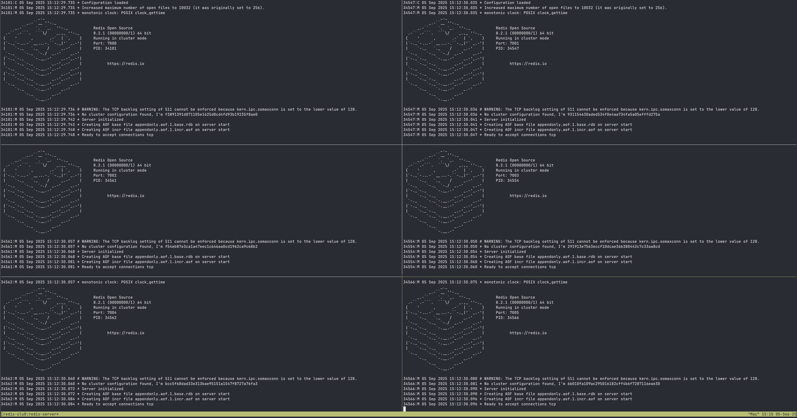

# Redis Cluster

A simple repository for spinning up a **Redis Cluster locally** on your machine **without Docker**. This project is designed for developers and DevOps engineers who want a fast, dependency‑light way to experiment with Redis clustering.

## Motivation

I got tired of fighting with Docker dependencies and networking issues just to spin up a Redis Cluster. After reading [Bertrand Oubida’s excellent write‑up](https://medium.com/@bertrandoubida/setting-up-redis-cluster-on-macos-cf35a21465a), I decided to simplify the process into a single `Makefile`. This repository encapsulates that approach. Not about originality—just a clean, reproducible Redis Cluster playground.

## Features



- Spin up a **6‑node Redis cluster** locally.
- No Docker required — runs natively on your machine.
- Simple `make` commands for starting, cleaning up, and restarting.
- Great for development, testing, and learning.

## Requirements

- macOS or Linux
- `redis-server` and `redis-cli` installed (>= 6.0 recommended)
- `make`

## Repository Structure

```
redis-cluster/
├── Makefile
├── README.md
└── conf/
    └── redis-<port>.conf   # Auto-generated configs per instance
```

## Usage

### Start Cluster
```bash
make start
```
This spins up multiple Redis instances (default 6) on ports `7000-7005` and forms a cluster.

### Stop & Clean Up
```bash
make clean
```
Stops Redis processes and cleans up configuration/data files.

### Rebuild
```bash
make restart
```
Cleans up and spins up the cluster again.

## Customization
- Change default ports and number of nodes by editing variables at the top of the `Makefile`.
- Configurations are auto-generated in the `conf/` folder but can be further customized if needed.

## Example Makefile Targets

```makefile
NODES=6
BASE_PORT=7000

start:
	@./scripts/start-cluster.sh 

clean:
	@pkill redis-server || true
	@rm -rf conf/* data/*

restart: clean start
```

## Credits
- Inspired by [Bertrand Oubida’s blog post](https://medium.com/@bertrandoubida/setting-up-redis-cluster-on-macos-cf35a21465a).

---

### Why This Repo?

This repository aims to save time and reduce frustration when experimenting with Redis Clusters. Instead of fighting Docker networking or managing container configs, you can launch everything natively in a few seconds with a single command.

